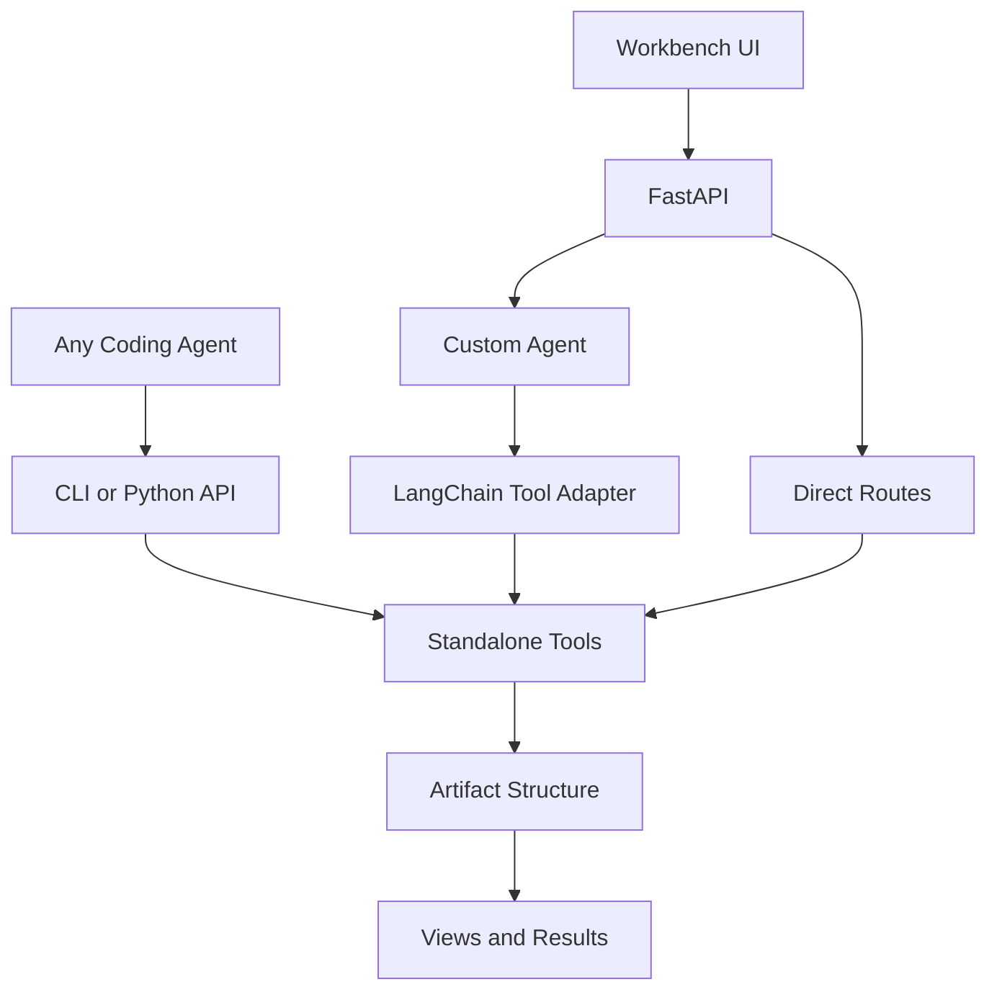
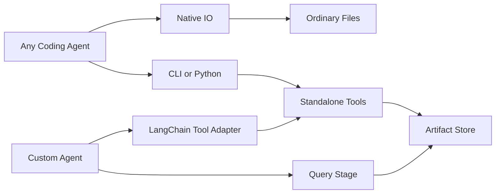
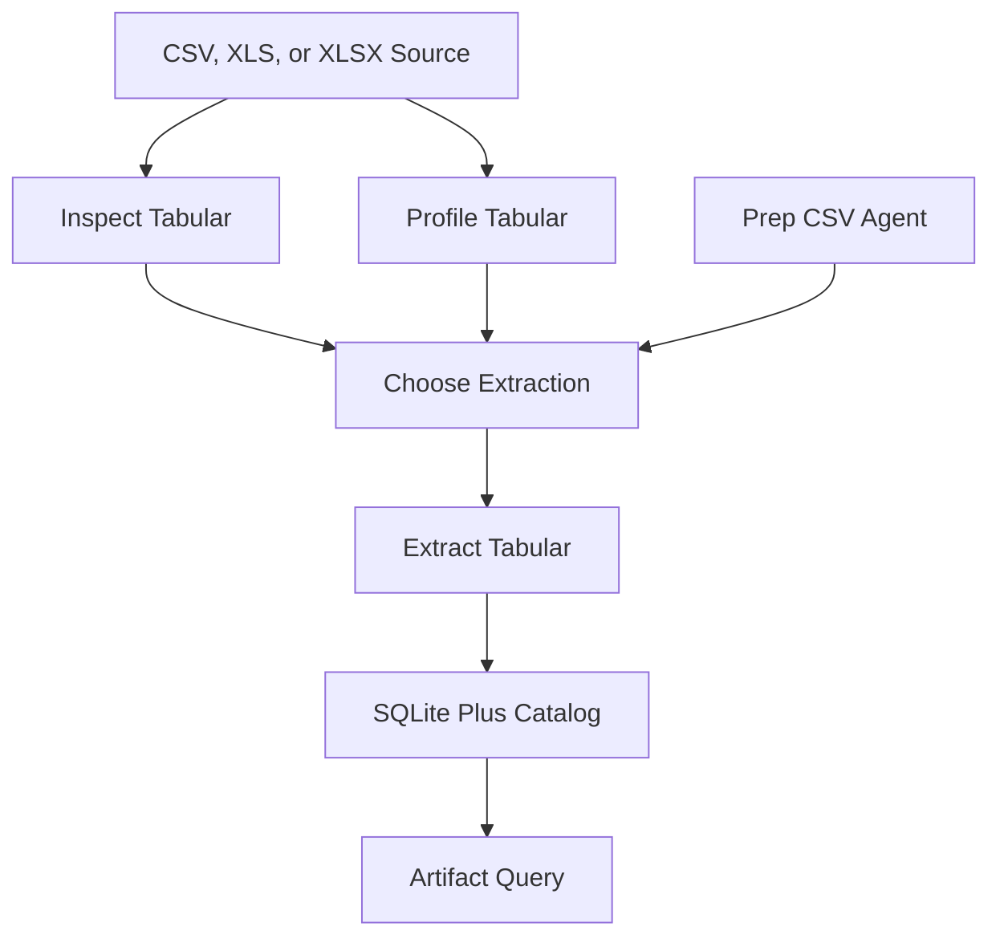
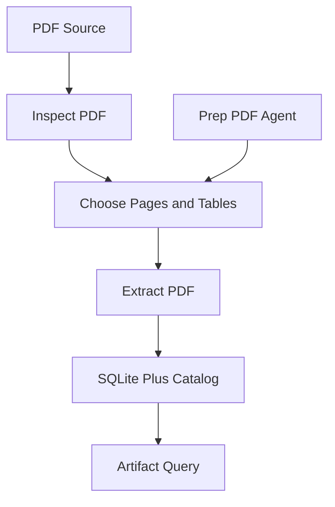
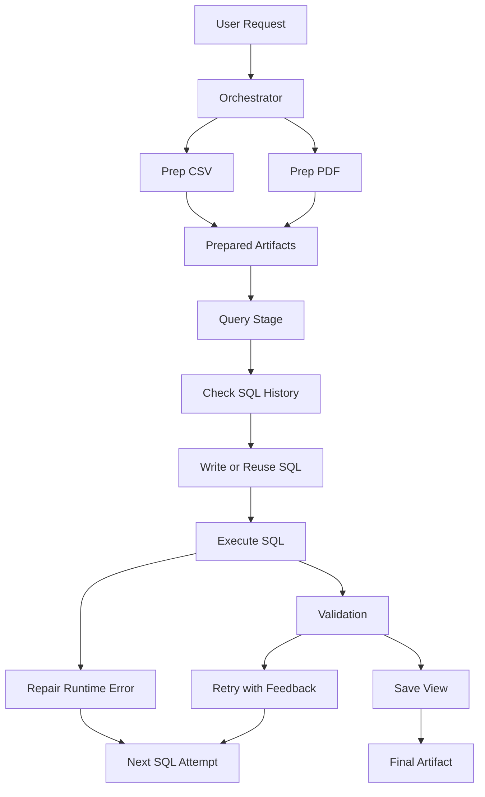
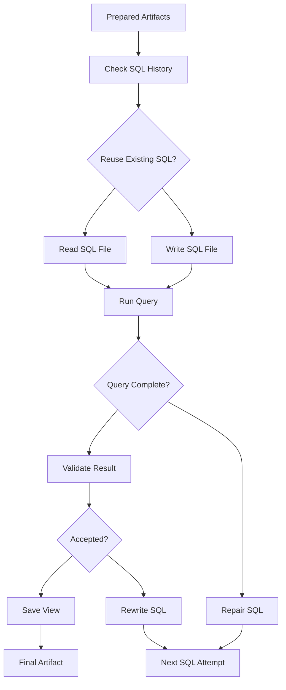

# Tabuflow

`Tabuflow` is a local workbench for coding-style data analysis over messy business files. It prepares CSV, XLS, XLSX, and PDF sources into queryable SQLite-backed artifacts, then lets an agent or CLI inspect, query, repair, and save useful views without forcing the user into vendor dashboards, notebooks, warehouse consoles, or BI tools.

The current rework goal is to make the useful data tools standalone and coding-agent agnostic. LangChain and LangGraph should be one consumer of the tool layer, not the shape that the tool layer is forced to fit. Any Coding Agent with normal shell/read/edit access, such as OpenCode, Pi, or Codex, should be able to use the same core operations through Python APIs or the `tabuflow` CLI, while the custom Tabuflow agent keeps its orchestration logic under `src/agents`.

Two notes capture the broader product direction:

- [OBSERVE.md](OBSERVE.md) records what has been learned from real files and tool experiments.
- [PLAN.md](PLAN.md) records the stabilization plan for the agent stack and workbench UI.

## Architecture



The important boundary is:

- `src/tools` contains standalone operations with ordinary Python inputs and outputs. These functions should not require LangGraph state, chat messages, or custom agent-only payloads.
- Any Coding Agent means the ordinary coding-agent shape: an agent such as OpenCode, Pi, or Codex that can run commands, read files, edit files, and call small repo-local scripts without becoming part of Tabuflow's custom graph.
- `src/cli.py` exposes a small preset surface for robust repeated operations: tabular inspection/extraction, PDF inspection/extraction, and prepared artifact queries. It is not meant to wrap generic filesystem editing because coding agents already have shell/read/edit tools.
- `src/agents/tool_adapter.py` is the LangChain tool adapter. It adapts standalone tools into LangChain tools and binds repo/workspace paths outside the model-visible schemas.
- `src/agents` owns the custom Tabuflow agent behavior: prep agents, Query Stage SQL reuse/history, validation, fixer, orchestration state, and graph routing.
- `src/tools/artifacts` owns the artifact directory/database helpers. SQL history reuse and SQL-file editing for the custom Query Stage stay in `src/agents/query_stage`.

The public surfaces expand into the tool layer like this:



Bound workspace and database configuration stays outside model-controlled arguments for both CLI presets and LangChain tool adapters.

## Tool Inventory

The standalone tool layer is intentionally smaller than the full custom agent:

- `tools.tabular`: inspect raw grids, profile table structure, and extract CSV/XLS/XLSX tables into SQLite-backed artifacts.
- `tools.pdf`: inspect PDF pages and extract PDF tables into SQLite-backed artifacts.
- `tools.mail`: inspect EML/MSG metadata, body previews, and attachments as reference context without turning emails into table artifacts.
- `tools.artifacts`: list/describe queryable artifacts, run read-only SQL, save query views, name SQL artifacts when an LLM namer is configured, and suggest deterministic SQLite repair hints from schema context.
- `tools.fs`: sandbox and workspace filesystem primitives used by adapters and custom agents, not a primary CLI value proposition for coding agents.
- `tools.skills`: workspace skill file helpers, kept separate from artifact structure even though both are directory-backed.

For Any Coding Agent usage, the repo should feel like a normal toolbelt:

- OpenCode, Pi, Codex, or another coding agent can call `tabuflow` commands for high-value data operations instead of reimplementing CSV/PDF/SQLite handling with ad hoc shell snippets.
- The same agent can still use its native shell/read/edit abilities for ordinary files, SQL drafts, scripts, and reports.
- Tabuflow should not require that agent to understand LangGraph state, message reducers, tool-call transcripts, or custom orchestrator fields.
- The custom Tabuflow agent remains available when the workbench needs a guided multi-stage flow with validation, trace messages, and saved views.

The LangChain-facing layer is now a tool-adapter layer:

- `agents/tool_adapter.py` creates LangChain tool wrappers around tabular, PDF, filesystem, and skill operations.
- `agents/fixer` is agent-centric and remains under `src/agents` because other coding agents do not need Tabuflow's fixer graph.
- `agents/query_stage` owns custom Query Stage behavior: SQL reuse, SQL artifact file edits, SQL history search, runtime repair loops, and validation retry state.
- `agents/orchestrator/state.py` now separates SQL state into reuse, execution, validation, and runtime slices instead of treating every field as one generic SQL artifact state.

The tabular preparation flow stays useful both standalone and through the custom agent:



The PDF preparation flow follows the same boundary:



## CLI

The CLI is a minimal preset surface over the standalone tools:

```bash
tabuflow tabular inspect path/to/file.csv
tabuflow tabular profile path/to/file.xlsx
tabuflow tabular extract path/to/file.csv
tabuflow pdf inspect path/to/file.pdf
tabuflow pdf extract path/to/file.pdf
tabuflow email inspect path/to/message.eml
tabuflow email inspect path/to/message.msg
tabuflow artifacts list
tabuflow artifacts from-source path/to/file.xlsx
tabuflow artifacts describe artifact_name
tabuflow artifacts query "select * from artifact_name limit 20"
tabuflow artifacts query @query.sql
tabuflow artifacts save-view saved_view_name @query.sql
```

`artifacts list` is compact and bounded by default. Use `--detail full`, `--max-items`, or `--all` when needed.

Generated artifact names often contain hyphens, so quote them in SQL: `select * from "service-usage-1cca2e" limit 20`.

The CLI deliberately does not expose storage root or database path knobs to the agent. The runtime resolves those from the local workspace/tool configuration. Agents can choose source paths and SQL text, but should not be able to redirect Tabuflow's artifact store.

## Agent Flow



This path is still useful for the Tabuflow workbench because it coordinates multi-step data work, validates the result, records trace messages, and saves named views. The rework does not remove the custom agent; it makes the underlying tools less dependent on it.

The Query Stage loop is intentionally agent-owned:



## Artifacts

Artifacts are a directory-backed working structure, similar in spirit to skills but not the same thing. Skills are reusable guidance packages. Artifacts are the concrete working products of a run: extracted tables, SQLite database state, SQL files, saved views, and catalog metadata.

The artifact module should make existing outputs easier to discover and reuse. It should not become a hidden agent brain. If a coding agent can read or edit an ordinary file directly, Tabuflow should not add a wrapper just to mirror that ability.

## Current Posture

The main runtime path is:

```text
Workbench UI -> FastAPI -> orchestrator -> Prep CSV / Prep PDF -> Query Stage -> validation -> saved view -> answer
```

The lower-level tool posture is:

- observe real files before inventing schemas,
- keep extraction conservative and inspectable,
- keep tabular, PDF, artifact catalog, SQLite query, and repair-hint helpers usable without LangChain,
- keep LangChain schemas and graph-state compatibility in `src/agents`,
- keep path and storage configuration outside model-editable tool arguments,
- use SQL artifacts as the deterministic bridge between messy inputs and user-facing answers,
- keep custom SQL history/reuse behavior in the agent layer until it proves useful as a standalone preset.
