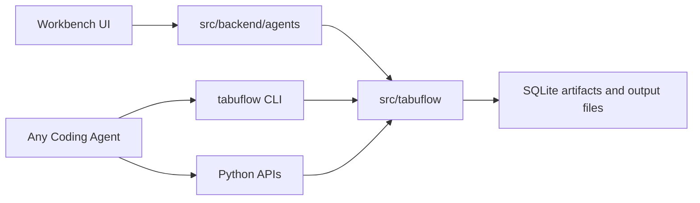

# Tabuflow

Tabuflow is a local workbench for coding-style data analysis over messy business files.

The core idea is simple: use robust tools to turn CSV, XLS, XLSX, PDF, and email reference files into inspectable artifacts, then let a coding agent, script, SQL file, or workbench flow do the actual reasoning and output work.

Tabuflow should not become a giant custom agent. The useful part is the tool layer.

## Core Boundary

`src/tabuflow` is the reusable layer. It should expose ordinary Python functions and CLI commands that work without LangGraph state, chat messages, or LangChain tool-call transcripts.

`src/backend/agents` is the custom Tabuflow agent layer. It can orchestrate multi-step workbench flows, validation, trace messages, SQL reuse, and fixer behavior, but it should not define the shape of the reusable tools.

LangChain is an adapter, not the foundation.



## Principles

- Inspect before extracting.
- Preserve source lineage.
- Keep extraction conservative and reviewable.
- Prefer explicit SQL/Python recipes over hidden workbook formulas or agent-only state.
- Keep generated artifact names out of business logic; rediscover outputs through catalog/source metadata.
- Use Tabuflow tools only where they beat ordinary shell/read/edit work.
- Keep domain skills outcome-first: inputs, outputs, validation, and failure modes, not command transcripts.

## Tool Shape

The reusable tools are intentionally small:

- `tabuflow.tabular`: inspect/profile/extract CSV, XLS, and XLSX files.
- `tabuflow.pdf`: inspect PDF text/images, prepare PDF artifact workspaces, and extract reviewed table drafts.
- `tabuflow.email`: inspect EML/MSG as reference context.
- `tabuflow.artifacts`: list, rediscover, suggest, describe, query, repair, and save SQLite-backed artifacts.

For cross-agent shell use, install the CLI once:

```bash
uv tool install /Users/teron/Projects/tabuflow
```

Tabuflow also exposes a minimal stdio MCP server for coding agents that support MCP:

```bash
tabuflow-mcp
```

Run Tabuflow from the project root. CLI and MCP tools always resolve artifact paths under the current working directory's `./artifacts/` path; callers choose source paths, sheet/page options, and SQL text, not storage roots or output directories.

The MCP server mirrors the standalone tool layer with `tabular_inspect`, `tabular_profile`, `tabular_extract`, `pdf_inspect`, `pdf_prepare`, `pdf_extract`, `email_inspect`, `artifacts_list`, `artifacts_from_source`, `artifacts_describe`, `artifacts_query`, and `artifacts_save_view`.

The CLI mirrors those useful presets:

```bash
tabuflow tabular inspect path/to/file.csv
tabuflow tabular profile path/to/file.xlsx
tabuflow tabular profile path/to/file.xlsx --all-sheets
tabuflow tabular extract path/to/file.csv
tabuflow pdf inspect path/to/file.pdf
tabuflow pdf prepare path/to/file.pdf
tabuflow email inspect path/to/message.msg
tabuflow artifacts list
tabuflow artifacts from-source path/to/file.xlsx
tabuflow artifacts suggest "..."
tabuflow artifacts describe artifact_name
tabuflow artifacts query @query.sql
tabuflow artifacts save-view saved_view_name @query.sql
```

The tool output should help a coding agent avoid dumb mistakes:

- `structure_hints` points to likely header and data-start rows.
- `excluded_row_hints` reports footer-like rows left outside extracted tables.
- `artifacts from-source` returns a preferred artifact and quoted preview SQL.

Artifact layout is part of the contract for coding-agent workflows:

- `artifacts/tabular.sqlite` for extracted CSV/XLS/XLSX tables.
- `artifacts/pdf/<source>/` for PDF visual/text workspaces and extracted table drafts.
- `artifacts/sql/` for reusable SQL or scratch transformation files.
- `artifacts/outputs/` for validated CSV/XLSX deliverables.

Inspection commands do not import source data and may leave the artifact tree absent until a writer needs it. For tabular inputs, run `tabuflow tabular extract ...` before expecting `artifacts/tabular.sqlite` or querying through `tabuflow artifacts ...`.

## Current Direction

The stable direction is command-first and recipe-backed.

Generic tools prepare and expose artifacts. Domain recipes, SQL files, small Python transforms, or skills can then produce outputs such as GCP Summary + IBS or AWS invoice tables. The workbench agent can orchestrate that flow, but the reusable truth should stay in repo-native commands, modules, artifacts, and output recipes.

Read next:

- [OBSERVE.md](OBSERVE.md): real-file lessons and decisions.
- [PLAN.md](PLAN.md): stabilization plan.
