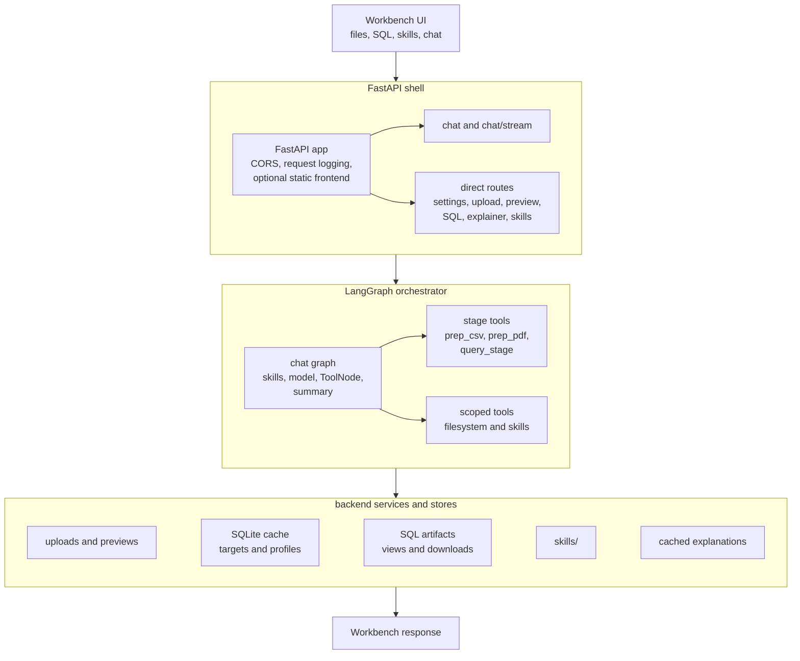
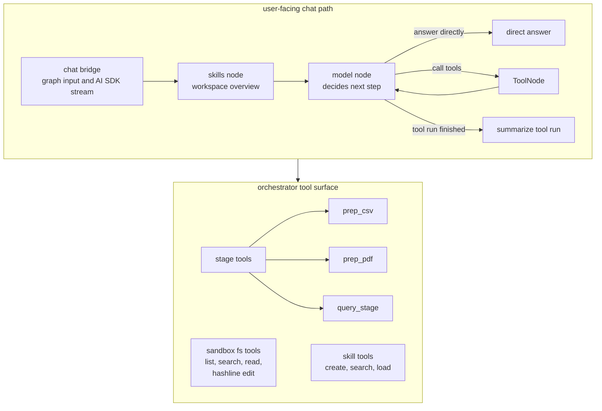
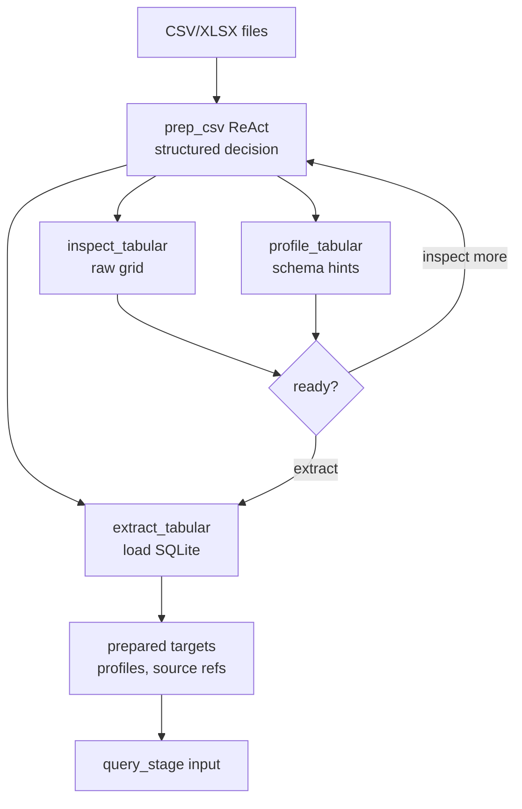
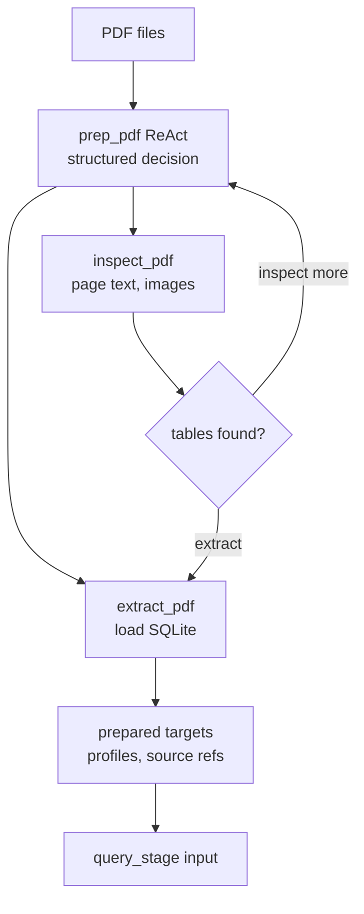
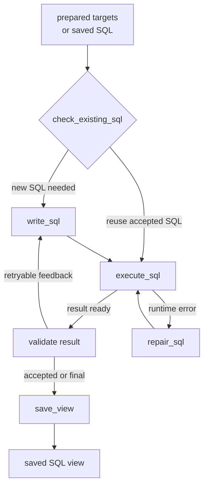

# Tabuflow

`Tabuflow` is a local workbench for helping non-technical users do coding-style data analysis over SQL without having to operate vendor-specific tools, cloud consoles, notebook platforms, or BI products directly.

The project exists to put an agentic coding workflow around ordinary business data: observe the source, plan the analysis, prepare queryable tables, write SQL, inspect results, repair mistakes, and save useful artifacts. The user should be able to ask for the analysis they need while the system handles the mechanics that normally require a data engineer, analyst notebook, warehouse UI, or vendor dashboard.

Real source files are still messy. CSVs can start with metadata, spreadsheets can hide several sparse tables in one sheet, and PDFs often need a different extraction path entirely. The useful shape is not "ask a model to read a file"; it is a bounded system where Python tools inspect and prepare the data, the agent chooses the right stage, SQL does the deterministic work, and the UI shows what happened.

Two notes capture the current direction:

- [OBSERVE.md](OBSERVE.md) records what has been learned from real files and tool experiments.
- [PLAN.md](PLAN.md) records the stabilization plan for the agent stack and workbench UI.

## Architecture



The orchestrator graph expands into the chat path and tool inventory:



The `prep_csv` tool owns CSV/XLSX inspection and extraction:



The `prep_pdf` tool owns PDF table inspection and extraction:



The `query_stage` tool owns the SQL loop:



The orchestrator is the user-facing LangGraph layer. It can answer ordinary questions directly, but for grounded work it can call stage tools, sandboxed filesystem tools, and skill tools:

- `prep_csv` prepares CSV/XLSX sources into SQL artifacts.
- `prep_pdf` prepares PDF table sources into SQL artifacts.
- `query_stage` writes or reuses SQL, executes it, repairs runtime failures, validates the result, and saves a view.
- `fs_list_files`, `fs_search_text`, `fs_read_text`, `fs_read_hashline`, and `fs_edit_hashline` keep file access sandboxed, with writes scoped to `.sql` files and workspace skill resources.
- `create_skill_package`, `search_skills`, and `load_skill` let the agent create deterministic skill frames and load situational guidance.

FastAPI also exposes direct workbench routes for upload, preview, SQL execution/download, file explanation, LLM settings, and skill editing. Those routes share the same local stores as the agent path: the SQLite cache, SQL artifacts, cached explanations, and `skills/`.

The backend stays Python-first because the hard parts are data inspection, parsing, OCR/table extraction, SQLite artifacts, and LangGraph workflows. The frontend is the operator surface: files, targets, SQL, saved views, skills, tool traces, and chat.

## Current Shape

The main runtime path is:

```text
Workbench UI -> FastAPI -> orchestrator -> prep_csv/prep_pdf -> query_stage -> validation -> saved view -> answer
```

The lower-level posture is:

- observe real files before inventing schemas,
- keep extraction conservative and inspectable,
- use Python libraries for parsing instead of shell-driven parsing,
- use SQL artifacts as the deterministic bridge between messy inputs and user-facing answers,
- keep write access scoped to SQL artifacts and workspace skill files.
